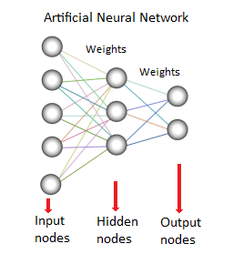
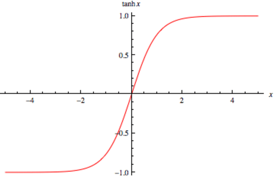

# __Neuroevolution of Augmenting Topologies (NEAT) plays Flappy Bird__

In this project I implemented the NEAT algorithm (using python-neat) to learn how to play Flappy Bird (made with pygame).

## Resume of NEAT in Flappy Bird

#### Introduction

NEAT is a Machine Learning algorithm designed with three basic principles:

  - __Nodes__: each neuron of the network. They store some sort of data.

  - __Connections__: the synapses of the network, when we compare it to our own brain. It is the data flows that connect one node to another.

  - __Weights__: They are part of the connections and mesure how intense this synapse must be. This value is calculated by a specific function, also called __activation function__.

In every neural network solution the first nodes are called the _input nodes_ and they recive some sort of data from the game that will be, in the future, processed by the network. And the last ones are the _output nodes_, any action or result determined by the network's processing is stored here and executed or not.

#### Configuration

In this implementation there is three input nodes:

  - The bird: 

  - The top pipe: 

  - The bottom pipe: 

Only one output node:

  - Choose if the bird jumps or not.

Activation function used is:

  - TanH:

  
